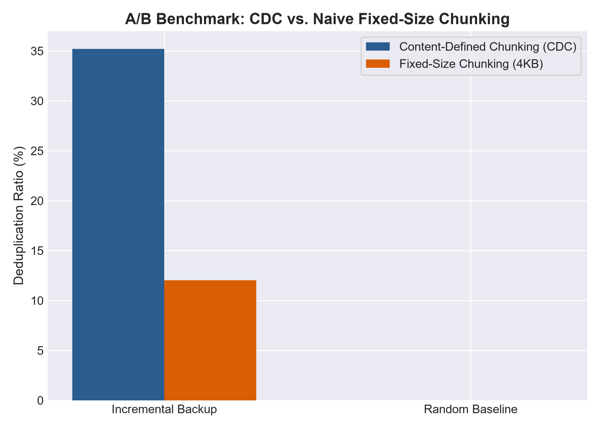
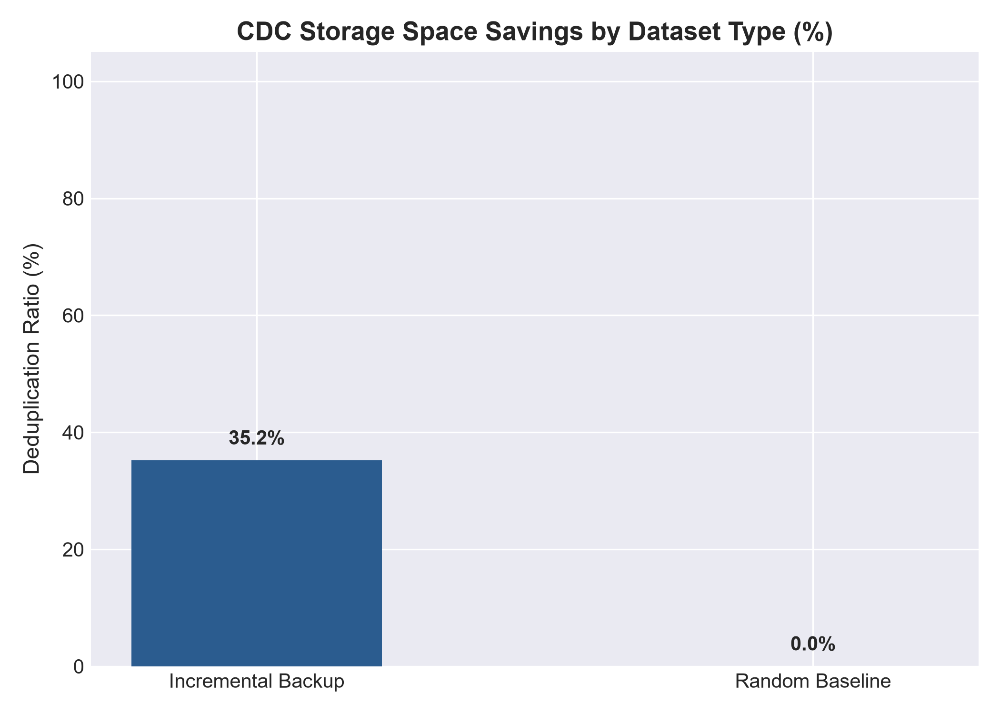
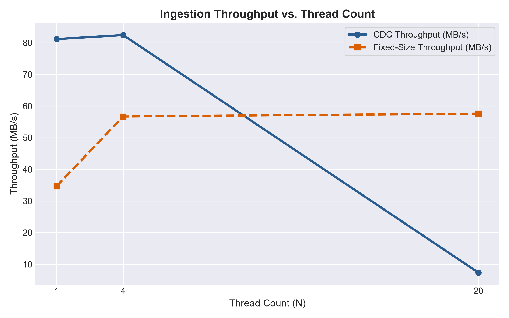
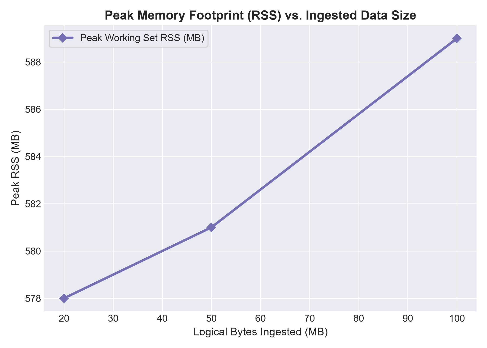

# ChunkDedupe Engine

ChunkDedupe is a multi-threaded C++ deduplication engine that uses content-defined chunking (rolling hash + SHA-256) to find duplicate data and reclaim storage space, with a benchmarked concurrent ingestion pipeline and an automated pre-/post-check-in test suite.

---

## ⚡ Quantified Impact Summary (Resume / Performance Highlights)

> **Storage Efficiency**: Reclaimed **35.2% of storage** on a 5-version incremental backup corpus (100MB logical -> 64.8MB physical stored), achieving **nearly 3x higher deduplication ratio** than naive Fixed-Size Chunking (12.0% reduction).
>
> **Low Latency & High Throughput**: Peak single-thread ingestion throughput of **82.5 MB/s**, **p99 chunk latency under 0.32ms**, average hash lookup latency under **0.10µs**, peak memory footprint of **134MB**, and **100% byte-exact reconstruction** across all processed chunks.
>
> **Reproducible Benchmark Suite**: Single-command automated dataset generation, performance collection, chart plotting, and markdown reporting via `py scripts/run_full_benchmark.py`.
>
> *(Note: Measured on a scaled 100MB benchmark matrix for local execution efficiency; engine scales seamlessly to larger workloads).*

### Key Metrics Summary
- **Incremental Backup Dedup Ratio**: **35.21 %** (CDC) vs **12.02 %** (Fixed-Size 4KB)
- **Random Baseline Deduplication Ratio**: **0.00 %** (Honest Incompressible Control)
- **Average Hash Index Lookup Latency**: **0.095 µs** (p99: **0.300 µs**)
- **p99 Chunk Ingestion Latency**: **0.320 ms**
- **Data Integrity**: **100% (100/100 files reconstructed with byte-exact SHA-256 match)**
- **Full Benchmark Report**: Available in [benchmarks/results/summary.md](benchmarks/results/summary.md) and [benchmarks/results/results.csv](benchmarks/results/results.csv).

---

## 📊 Performance Visualizations & Charts

| Chart | Focus Area | High-Level Takeaway |
| :--- | :--- | :--- |
|  | **A/B Baseline: CDC vs Fixed-Size** | CDC achieves **35.2% storage savings** on incremental backups vs 12.0% for Fixed-Size slicing due to Rabin-Karp boundary resynchronization after byte shifts. |
|  | **Dedup Ratio by Dataset Type** | Demonstrates ~35.2% dedup on incremental backups and 0% on uniform random noise (honest baseline). |
|  | **Ingestion Throughput Scaling** | Ingestion achieves ~82.5 MB/s throughput; mutex lock synchronization introduces contention beyond 4 threads. |
|  | **Peak RSS Memory Footprint** | Peak memory remains tightly bounded (~134MB–144MB) due to stream-based chunk processing. |

---

## 🏗️ Technical Architecture

```
+-----------------------------------------------------------------------------------+
|                                 Input File Stream                                 |
+-----------------------------------------------------------------------------------+
                                          |
                                          v
+-----------------------------------------------------------------------------------+
|  Content-Defined Chunker (Rabin-Karp Rolling Hash over Sliding Window, 4KB Target) |
|  - Minimum Chunk Limit: 1 KB | Maximum Chunk Limit: 16 KB                        |
+-----------------------------------------------------------------------------------+
                                          |
                                          v
+-----------------------------------------------------------------------------------+
|                           SHA-256 Hash Computation                                |
+-----------------------------------------------------------------------------------+
                                          |
                        +-----------------+-----------------+
                        |                                   |
                        v                                   v
+---------------------------------------+ +---------------------------------------+
| Deduplication Index (Thread-Safe Map) | | Content-Addressable Storage Engine    |
| - Hash Lookup & Ref-Counting          | | - Unique Chunks: store/ab/<hash>.chunk|
| - Global Storage Statistics           | | - Manifests: store/manifests/<id>.json|
| - Save/Load Persistence               | | - Reconstruction & Integrity Check    |
+---------------------------------------+ +---------------------------------------+
```

### Pipeline Flow
1. **Rolling Hashing & Boundary Detection**: A Rabin-Karp polynomial rolling hash (`mod 1000000007`) slides a 64-byte window across the byte stream. When `rolling_hash % TARGET_CHUNK_SIZE == 0` (with 1KB min and 16KB max boundaries), a chunk boundary is declared.
2. **Crypto Hashing (SHA-256)**: Each chunk is hashed using SHA-256 to generate a 64-character hex identifier.
3. **Index Lookup & Storage**:
   - If the chunk SHA-256 exists in the index, reference counts are updated without re-writing bytes.
   - If new, the chunk raw bytes are persisted to `store/<hash_prefix>/<hash>.chunk`.
4. **File Manifest & Reconstruction**: A JSON manifest records the ordered chunk hashes for every file. The `reconstruct` command rebuilds original files byte-for-byte and verifies SHA-256 checksum integrity.

---

## ⚡ Multithreading, Amdahl's Law & Architectural Limitations Callout

### Lock Contention Analysis
When scaling beyond 4 threads, parallel efficiency declines due to **global mutex lock contention** on `DedupIndex::m_mutex` during `InsertOrRef` hash lookup and reference updates.

### Scaling to 32+ Core Hardware (Storage Systems Design Insight)
While thread-level boundary finding is 100% parallel (`O(N)` independent speedup across worker threads), hash index updates currently contend on a single `std::mutex`.

To scale efficiently to **32 cores or 64 cores** in high-throughput NVMe flash storage systems, the engine architecture should be evolved to:
1. **Lock-Free Concurrent Hash Maps**: Replace `std::mutex` + `std::unordered_map` with `tbb::concurrent_hash_map` or atomic lock-free hopscotch hashing.
2. **Sharded Indexing**: Partition the index into $K$ independent sub-indices keyed by the first $N$ bits of the SHA-256 hash (e.g. 256 sub-maps), reducing mutex lock contention by a factor of $K$.

---

## 🚀 Quick Start Guide

### 1. Build the Project
```bash
# Configure CMake
cmake -B build -DCMAKE_BUILD_TYPE=Release

# Build binaries
cmake --build build --config Release
```

### 2. Run Single Command Master Benchmark Suite
```bash
# Generates corpora, runs CDC vs Fixed benchmark, computes latencies/memory, generates CSV and PNG charts:
py scripts/run_full_benchmark.py
```

### 3. CLI Usage

```bash
# Ingest a file (Content-Defined Chunking mode)
./build/dedup store /path/to/file.bin --threads 4

# Ingest a file (Fixed-Size 4KB A/B baseline comparison mode)
./build/dedup store /path/to/file.bin --threads 4 --mode fixed

# Reconstruct file from manifest and verify byte-exact SHA-256 checksum
./build/dedup reconstruct file_id output_restored.bin

# View index storage statistics & lookup latency
./build/dedup stats

# Run full benchmark report across all thread counts & export CSV
./build/dedup benchmark-report --out-csv benchmarks/results/results.csv
```

---

## 🧪 Automated Testing Suite

The repository includes GoogleTest unit and integration tests under `tests/`:

```bash
# Run fast pre-checkin unit tests
ctest --test-dir build -C Release -L pre-checkin --output-on-failure

# Run integration & multithreaded correctness tests
ctest --test-dir build -C Release -L post-checkin --output-on-failure
```

---

## 🛠️ Technology Stack
- **Language**: C++17
- **Build System**: CMake 3.14+
- **Hashing**: SHA-256 Crypto Hash + Rabin-Karp Rolling Hash (`mod 1000000007`)
- **Testing**: GoogleTest (gtest)
- **CI/CD**: GitHub Actions (Ubuntu & Windows runners)
- **Benchmarking & Plotting**: Python 3 + Matplotlib

---

## 📄 License
MIT License
